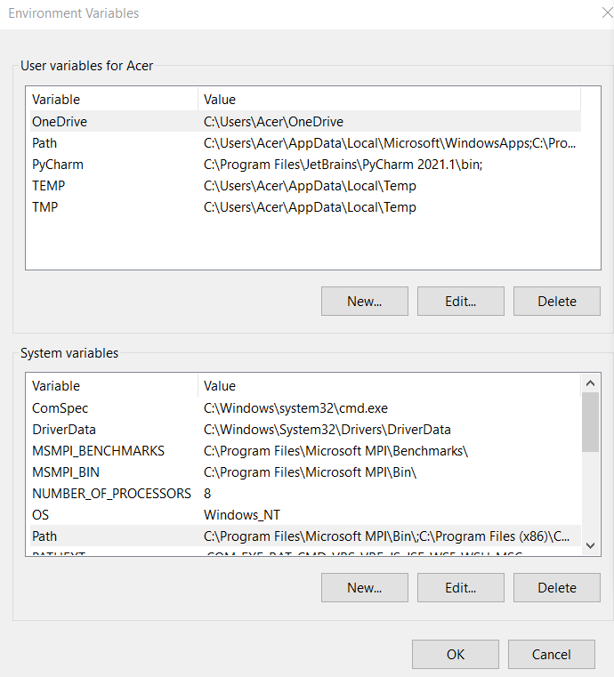
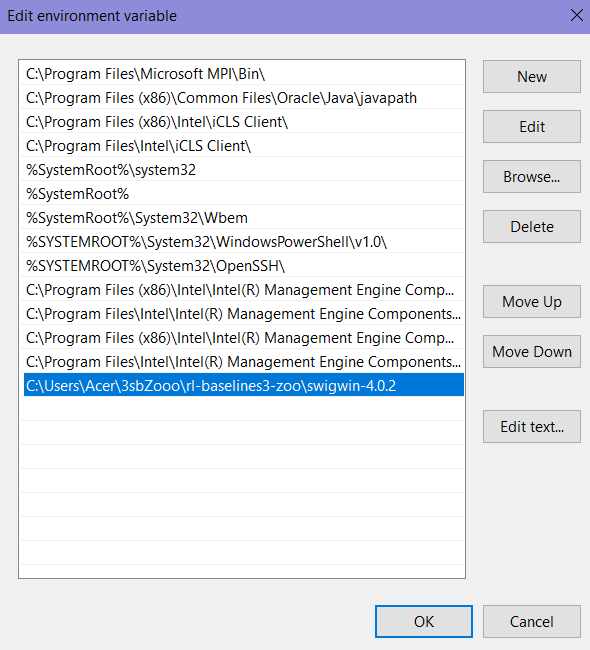

# oekolopoly-rl  [](https://upload.wikimedia.org/wikipedia/commons/a/a5/Blue_Python_3.8_Shield_Badge.svg)
A repository aimed at performing different RL-Algorithms on the custom environment [Oekolopoly](https://github.com/cherrisimo/oekolopoly) using [RL-Baselines3-Zoo](https://github.com/DLR-RM/rl-baselines3-zoo) Framework. 

## Repo structure overview

* [oekolopoly](https://github.com/cherrisimo/oekolopoly-rl/tree/main/oekolopoly) contains the Oekolopoly environment with following differences:
  * The observation space no longer contains the flag valid_turn as it brings no information about the state of the environment and is better to be stored in a variable within the step function. 
  * Assertions have been added instead of some if-statements for consistency and better readability.
  * Added reward, which is focused on keeping the Life Areas *Produktion* and *Bevoelkerung* in their middle values.
  * Multiply render functions have been added to showcase each round of the agents' actions.
  * A registered wrapper, which transforms the action space to Box type and has two functions to correct input action values. For the RL-experiments the first one is being invoked.
* [oekolopoly_agents](https://github.com/cherrisimo/oekolopoly-rl/tree/main/oekolopoly_agents) carries zip folders with trained agents grouped by the wrapper and algorithm they've been trained with.
 
## Installing

Note: **Python 3.8** is the required for this project because of the module [pytype](https://github.com/cherrisimo/pytype). Also please use the [environment](https://github.com/cherrisimo/oekolopoly-rl/tree/main/oekolopoly) provided in **this repository** as it is the latest code version of the game Oekolopoly.

### Let's get started: 
1. Create a new environment with **tensorflow** and the required Python version installed as followed:

```shell
conda create -n env_name tensorflow python=3.8
```

or install **tensorflow** in an existing one:

```shell
conda install -c anaconda tensorflow
```

2. Activate environment and install **pytype**, **pybullet** and **box2dpy**:

```shell
conda activate env_name
```
```shell
conda install -c conda-forge pytype
```
```shell
conda install -c conda-forge pybullet
```
```shell
conda install -c conda-forge box2d-py
```
3. Install pyglet for rendering functions in the environment:

```shell
pip install pyglet
```
4. Install git:
```shell
conda install git
```

RL-Baselines3-Zoo contains further repositories, where over 100 pretrained agents reside. The argument `--recursive` is used to clone them as well. They can be found in folder `rl-trained-agents` in the directory of the cloned repository `rl-baselines3-zoo`.

Note: As of now not sure how to clone the baselines repository with its sub-repos using GitHub Desktop and not aware if there would be any repercussions when the sub-repos are missing. 

5. Clone respective repository with its sub-repos:
```shell
git clone --recursive https://github.com/DLR-RM/rl-baselines3-zoo
```

6. In the repository folder execute following command:

```shell
cd rl-baselines3-zoo
pip install -r requirements.txt
```

## Usage

1. Add custom environment to `utils/import_envs.py` by pasting the following lines:

```python
try:
    import oekolopoly
except ImportError:
    oekolopoly = None
```

2. Configure hyperparameters in `rl-baselines3-zoo/hyperparams/ppo.yml` for the **PPO** algorithm as shown below:

```python
  Oekolopoly-v0:
  env_wrapper:
  - utils.wrappers.OekoBoxActionWrapper
#  - utils.wrappers.OekoSimpleActionWrapper
#  - utils.wrappers.OekoSimpleObsWrapper
#  - utils.wrappers.OekoRewardWrapper
  n_envs: 8
  n_timesteps: !!float 1e5
  policy: 'MlpPolicy'
  n_steps: 32
  batch_size: 256
  gae_lambda: 0.8
  gamma: 0.98
  n_epochs: 20
  ent_coef: 0.0
  learning_rate: lin_0.001
  clip_range: lin_0.2
```
The aforementioned hyperparameters are tuned and have been sampled from the CartPole-v1 environment.

Adding each wrapper as argument in the hyperparamter list does not require registering it as new environment. All wrappers are to be found under `utils/wrappers.py`. The implementation of each wrapper can be found in [wrappers.py](https://github.com/cherrisimo/oekolopoly-rl/blob/main/wrappers/wrappers.py) in this repository. 
    
3. If custom environment is not yet installed, now it can be done. Go to the respective folder of the environment where `setup.py` is visible and execute the command:

```shell
pip install -e .
```

Optionally, create a folder to store each trained agent. A further folder named after the used algorithm for the trained agent should reside in it as shown below:

```
├── oekolopoly_agents
│   └── ppo
│       ├── Oekolopoly-v0_10
│       └── ...
└── logs
    └── benchmark
    └── ppo
    └── ...
```
If not done, `logs` stores the newly trained agents per default.

----- Following commands should always be executed while being in the repo folder `rl-baselines3-zoo`. -----
### Train an agent:

```shell
python train.py --algo ppo --env Oekolopoly-v0 -f oekolopoly_agents --tensorboard-log tensorboard-log
```
* `--algo`: specifies the algorithm to be executed
* `--env`: name of environment
* `-f`: save agent to desired folder. If not defined, `logs` is used as the default path, therefore it's an optional paramater.
* `--tensorboard-log tensorboard-log`: save data about training to later generate a graph. [See this section.](https://github.com/cherrisimo/oekolopoly-rl#generate-graphs)

### Train a certain agent more:

```shell
python train.py --algo ppo --env Oekolopoly-v0 -i oekolopoly_agents/ppo/Oekolopoly-v0_10/Oekolopoly-v0.zip
```
* `-i`: path to the particular agent

### See trained agent in action:

```shell
python enjoy.py --algo ppo --env Oekolopoly-v0 -f oekolopoly_agents --exp-id 9
```
* `--exp-id 9`: enjoy a particular agent. If not defined, the last trained agent is called per default, therefore it's an optional paramater.
* `-f`: assigning the folder is optional

## Analyse and compare agents

### Benchmarks

The table in `benchmark.md` displays only agents with the highest performance (not quantatively evaluated as stated by RL Baselines3 Zoo). In order to see own trained agent in comparison with the ones from baselines, the folder of the wished agent should be pasted to the `rl-trained-agents` directory. For example the first agent trained with PPO is to be displayed in the benchmark table, thus requiring the folder of the agent `Oekolopoly-v0_10` to be moved to `rl-trained-agents`. 

Path to agent's folder: **oekolopoly_agents** -> **ppo** -> **Oekolopoly-v0_10**

Now generate benchmark:

```shell
python -m utils.benchmark --log-dir rl-trained-agents
```
* `--log-dir`: specify folder with agents

Generate benchmark for all agents used on own custom environment:

```shell
python -m utils.benchmark --log-dir oekolopoly_agents
```

Note: Oftentimes the generating of the benchmark fails and the loading of the table in the command prompt "freezes". A solution for now is moving own agents to the `rl-trained-agents` directory and deleting the rest in order to see only chosen agents in comparison.

Note: Generating benchmark for own agents from the `logs` directory is not possible because it clashes with the `benchmark` folder there - either loading "freezes" or it starts generating a benchmark for *ALL* trained agents which takes all too long. 

### Tensorboard

Following command leads to a localhost webpage where performance of different agents is showcased via graphs:

```shell
tensorboard --logdir tensorboard-log
```

## Overview of commands and folders

Following table lists folders which are accessed per default by the respective command and which file is being invoked/altered as a result.

Command      | Default Folder    | Path to File/Implementation
------------ | -------------     | -------------
train        | logs              | rl-baselines3-zoo/train.py
enjoy        | rl-trained-agents | rl-baselines3-zoo/enjoy.py
benchmark    | rl-trained-agents | rl-baselines3-zoo/benchmark.md or logs/benchmark/benchmark.md

## Manual evaluation of agents

The contents of folder [eval](https://github.com/cherrisimo/oekolopoly-rl/blob/main/eval) must be copied to the the `rl-baselines3-zoo` directory. The UI is programmed in PyQt5 and requires its installation:
```shell
pip install PyQt5
```
In the command prompt navigate to the `rl-baselines3-zoo` directory and start the evaluation program using:
```shell
python play.py
```
Choose an agent by selecting a valid .zip-Folder following the path: `oekolopoly_agents/ppo/Oekolopoly-v0_10/Oekolopoly-v0.zip`. It contains necessary informations about the agent. The video material showcases a quick guidance on further usage of the UI.

## Optional requirements

This section is relevant in case there are further errors and therefore RL-Baselines3-Zoo could not be installed properly.

* A compiler may be needed for compiling modules like PyBullet. As such here is used [Visual Studio](https://visualstudio.microsoft.com/downloads/) Community version. No further settings are required.
* In case the building of wheels for pytype fails [SWIG](https://sourceforge.net/projects/swig/) must be downloaded and unzipped to any desired directory. Next up set Environment Variables as follows:
    
   1. Go to **Settings** -> **System** -> **About** -> **System info** -> **Advanced system settings** -> **Environment Variables...**  <sub> *[Tutorial with images](https://superuser.com/questions/949560/how-do-i-set-system-environment-variables-in-windows-10)* </sub>

   2. In second half of the window under **System Variables** select `Path`
    
   3. Create a new path to the directory where the unzipped **swigwin** folder resides as shown in the second image below.
   
   
   
   
   ## TO DO
   -  [x] Develop further Wrapper to split the observation space in low-medium-high
   -  [x] Develop another Wrapper to split action in three sectors which are to be distributed among the 5 Life Areas
   -  [x] Test and compare different rewards on PPO, A2C, DDPG, TD3, SAC with wrappers
   
   ## Resources
   * [Stable Baselines3](https://stable-baselines3.readthedocs.io/en/master/guide/rl_zoo.html)
